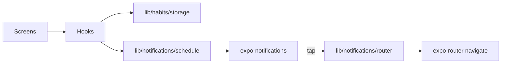

# Streaks — Habit Tracker with Notifications

In‑depth build plan for the Mobile Development Cohort assignment (React Native + Expo SDK 55, expo-router, expo-notifications).

> Scope reminder: push notifications **do not** work in Expo Go. A dev client built with EAS is required to grade Section 7.

---

## 0. Guiding Principles

1. **Notification side effects live in `src/lib/notifications/`** — components only call hooks.
2. **Reactive to permissions** — every notification entry point checks status first; UI shows a denied state with an "Open Settings" deep link.
3. **One source of truth for habits** — `useHabits` wraps storage; no component reads AsyncStorage directly.
4. **One tap handler** — local and push notifications go through the same `useNotificationRouter` so deep linking is shared.
5. **Persist notification IDs per habit** — required to cancel only that habit's reminders on edit/delete.
6. **Fail closed, never crash** — denied permission, missing habit on deep link, invalid token: all handled.

---

## 1. Architecture

```
src/
  app/
    _layout.tsx              # Root: mounts NotificationProvider + Stack
    index.tsx                # Today list, done buttons, streak chips
    new.tsx                  # Create/edit habit (uses ?id= for edit)
    settings.tsx             # Permission status, push token, copy, open settings
    habit/[id].tsx           # Detail screen = deep-link target

  lib/
    habits/
      types.ts               # Habit, Frequency, helpers
      storage.ts             # AsyncStorage CRUD (load/save/upsert/remove)
      streak.ts              # Pure streak math (testable)

    notifications/
      setup.ts               # Handler, Android channel, permission helper
      schedule.ts            # scheduleHabit / cancelHabit / rescheduleHabit
      push.ts                # registerForPushNotificationsAsync, token mgmt
      router.ts              # Pure: payload -> href

  hooks/
    use-habits.ts            # Reactive habit store + actions
    use-push-notifications.ts# Token + permission state
    use-notification-router.ts # Wires tap responses to expo-router

server/                      # (Optional stretch)
  send.ts                    # Node script using expo-server-sdk
```

### Data flow



---

## 2. Data Model

```ts
export type Frequency =
  | { kind: 'daily';  hour: number; minute: number }
  | { kind: 'weekly'; weekdays: number[]; hour: number; minute: number }; // 1=Sun..7=Sat (Expo convention)

export type Habit = {
  id: string;                  // uuid
  name: string;
  emoji: string;
  frequency: Frequency;
  notificationIds: string[];   // one per scheduled trigger (weekly => up to 7)
  streak: number;
  lastCompletedISO: string | null;
  createdAtISO: string;
};
```

Storage key: `@streaks/habits/v1` — single JSON blob. Migrate by bumping the version suffix.

---

## 3. Notifications Module

### 3.1 `setup.ts`
- `Notifications.setNotificationHandler({ handleNotification: async () => ({ shouldShowBanner: true, shouldShowList: true, shouldPlaySound: true, shouldSetBadge: true }) })` — **foreground handler**.
- `ensureAndroidChannel()` — creates `habit-reminders` channel with `Notifications.AndroidImportance.HIGH`, vibration, sound. Called from `_layout.tsx` on mount, **before** permission request.
- `ensurePermissionsAsync()` — returns `{ granted, canAskAgain, status }`. Never throws.
- `openSystemSettings()` — `Linking.openSettings()`.

### 3.2 `schedule.ts`
- `scheduleHabit(habit)` → `string[]` of notification IDs.
  - Daily: one `DailyTriggerInput` (`{ hour, minute, repeats: true, channelId: 'habit-reminders' }`).
  - Weekly: one `WeeklyTriggerInput` per selected weekday.
- `cancelHabit(habit)` — iterates `habit.notificationIds`, calls `cancelScheduledNotificationAsync(id)`. Swallows "not found" errors.
- `rescheduleHabit(oldHabit, nextDraft)` — `cancelHabit(oldHabit)` then `scheduleHabit(nextDraft)`, returning new IDs to persist.
- All content uses payload `{ screen: '/habit', habitId }`.

### 3.3 `push.ts` (reuse existing file)
- `registerForPushNotificationsAsync()` — checks permission, fetches `getExpoPushTokenAsync({ projectId })`, returns token string or `null`.
- Stores token in AsyncStorage under `@streaks/pushToken` for later server sync.
- Exports `copyTokenToClipboard()` helper using `expo-clipboard`.

### 3.4 `router.ts` + `useNotificationRouter`
- Pure `resolveHref(data)` → `'/habit/[id]'` href or `null`.
- Hook handles:
  - **Cold start**: `Notifications.getLastNotificationResponseAsync()`.
  - **Warm tap**: `Notifications.addNotificationResponseReceivedListener`.
- Same handler for local & push (Expo delivers both via the same response API).
- On missing/invalid `habitId`, navigate to `/` and show a toast.

---

## 4. Streak Logic (`lib/habits/streak.ts`)

Pure function `markDone(habit, today = new Date())`:

```
last = habit.lastCompletedISO
if last === today  → no-op (idempotent)
else if last === yesterday → streak += 1
else → streak = 1            # first completion OR missed a day → reset to 1
return { ...habit, streak, lastCompletedISO: today }
```

A passive `getDisplayStreak(habit, today)` returns `0` if `lastCompletedISO` is older than yesterday — so the UI shows the *true* current streak without needing a background job.

---

## 5. Screen Responsibilities

| Screen | Reads | Writes | Notes |
|---|---|---|---|
| `index.tsx` | `useHabits()` | `markDone(id)` | Filter to "due today" by frequency; show emoji, name, streak |
| `new.tsx` | route params | `createHabit`, `updateHabit` | On submit: schedule → persist IDs |
| `habit/[id].tsx` | `useHabit(id)` | `deleteHabit(id)` | Deep-link target; show full detail + history |
| `settings.tsx` | permission + token | `register`, copy, openSettings | Denied state with CTA |

---

## 6. Edit & Delete Contract (rubric §2)

**Edit:**
```ts
const old = await storage.get(id);
await cancelHabit(old);                       // uses old.notificationIds
const ids = await scheduleHabit(draft);       // new ids
await storage.upsert({ ...draft, notificationIds: ids });
```

**Delete:**
```ts
const old = await storage.get(id);
await cancelHabit(old);                       // ONLY this habit's ids
await storage.remove(id);
```

Never call `cancelAllScheduledNotificationsAsync()` in product code.

---

## 7. Permissions Flow

1. App boots → `_layout.tsx` calls `ensureAndroidChannel()` then `ensurePermissionsAsync()`.
2. If `status === 'denied'` and `!canAskAgain` → mark in store; screens render denied banner.
3. Settings screen shows: status badge + `Open System Settings` button (only enabled when truly denied).
4. Scheduling functions are no‑ops when not granted and return `[]` so storage stays consistent.

---

## 8. Android Channel — Why Before Permission?

> Writeup answer (rubric §6 & §9):
> On Android 8+, every notification must belong to a channel. The channel defines importance, sound, vibration, and lock-screen visibility — and **the user can change those after the fact, but the app can't**. On Android 13+, the permission dialog shows the channel name(s), so the channel must already exist when `requestPermissionsAsync` is invoked. If the channel is created *after* permission is granted, the first reminder may post to the default low‑importance channel and never appear as a heads‑up.

---

## 9. Push Notifications (rubric §7)

1. Build dev client: `eas build --profile development --platform android` (and iOS if certs available).
2. On first launch of Settings screen → `registerForPushNotificationsAsync()`.
3. Display token in monospace + `Copy` button.
4. Test path A — **expo.dev/notifications**: paste token, set `data = { "screen": "/habit", "habitId": "<real id>" }`.
5. Test path B — **cURL**:
   ```bash
   curl -X POST https://exp.host/--/api/v2/push/send \
     -H 'Content-Type: application/json' \
     -d '[{"to":"ExponentPushToken[...]","title":"Drink water 💧","body":"Tap to log it","data":{"screen":"/habit","habitId":"abc"}}]'
   ```
6. Test path C — `server/send.ts` using `expo-server-sdk` (stretch).
7. Foreground demo: app open → banner appears via handler.
8. Background demo: app killed → OS tray → tap → deep link to `/habit/abc`.

---

## 10. Writeup Cheatsheet (rubric §9)

- **Local vs push** — local is OS-scheduled on device (works offline, no token); push originates from a server, routed via APNs/FCM through Expo. Use local for *known future* reminders, push for *server-driven* events (announcements, streak nudges based on server state).
- **Ticket vs receipt** — `POST /push/send` returns a **ticket** ( `{status:'ok', id}` ) meaning Expo accepted it. A **receipt** (`POST /push/getReceipts`) confirms delivery to APNs/FCM; check receipts a few minutes later to detect `DeviceNotRegistered`, `MessageTooBig`, etc.
- **DeviceNotRegistered** — the token is no longer valid (app uninstalled, user disabled notifications, reinstall changed token). Server must drop the token from its DB to stop sending.
- **Expo Go limitation** — Expo Go no longer ships with push entitlements for SDK 53+; you must use a dev/standalone build for push. Local notifications still work in Expo Go.
- **Android channel** — see §8.

---

## 11. Stretch Goals (priority order)

1. **Snooze action** (`Notifications.setNotificationCategoryAsync('habit', [{identifier:'SNOOZE', buttonTitle:'Snooze 10m'}, {identifier:'DONE', buttonTitle:'Done'}])`) — handle in response listener.
2. **Badge count** = number of habits due today not yet completed.
3. **Quiet hours** — wrap `scheduleHabit` to skip triggers inside the window.
4. **Tiny Node server** with `expo-server-sdk` + receipts loop.
5. **Calendar heatmap** of completions.

---

## 12. Milestones

| Day | Outcome |
|---|---|
| 1 | Project scaffold, types, storage, today screen with mock data |
| 2 | Notification setup + daily/weekly scheduling, create form working |
| 3 | Edit/delete with proper cancel, streak engine, deep linking from local |
| 4 | EAS dev build, push registration, copy token, foreground + background demos |
| 5 | Polish, denied-permission UX, README, writeup, demo recording |

---

## 13. Acceptance Checklist (mirrors rubric)

- [ ] Create/edit/delete habit persists across app kill
- [ ] `notificationIds` stored & visible in dev tools
- [ ] Daily reminder fires at chosen time
- [ ] Weekly reminder fires only on selected weekdays
- [ ] Edit replaces old IDs (verified via `getAllScheduledNotificationsAsync`)
- [ ] Delete cancels only that habit's IDs
- [ ] Streak: +1 on consecutive day, reset on miss, idempotent same-day
- [ ] Local tap → `/habit/[id]`
- [ ] Push tap → `/habit/[id]` (same handler)
- [ ] Permission denied: no crash, banner + Open Settings works
- [ ] Foreground banner visible (handler returns `shouldShowBanner: true`)
- [ ] Android channel `habit-reminders` created at boot, HIGH importance
- [ ] Expo push token shown, copyable, real push received
- [ ] Foreground & background push behavior recorded in demo
- [ ] No notification code inside components
- [ ] README + writeup answer all §9 questions
