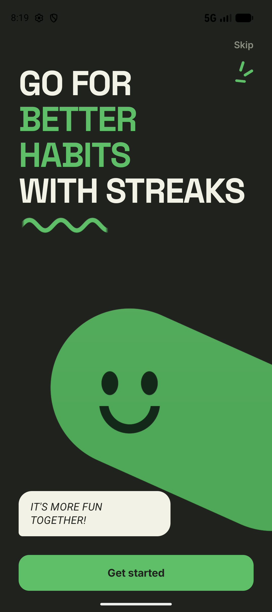
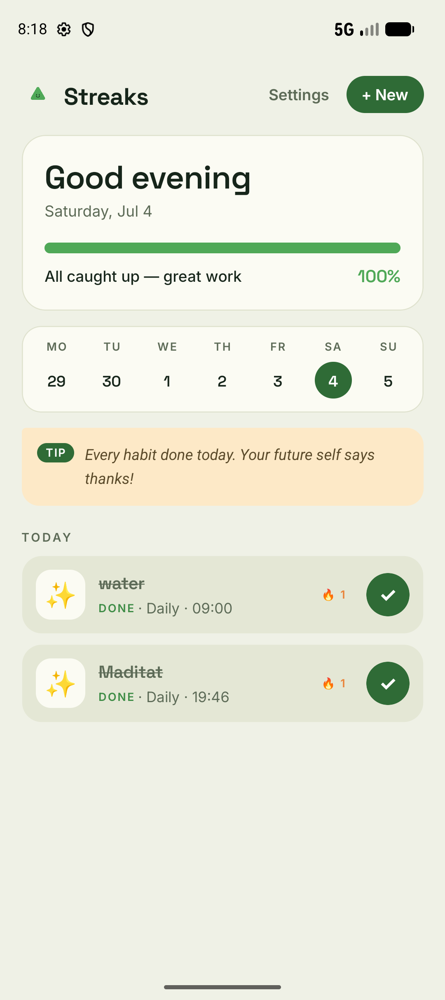
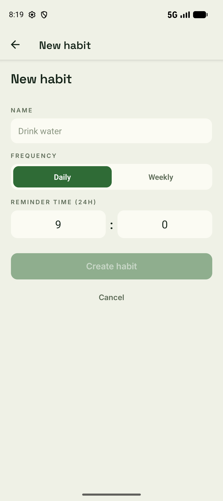
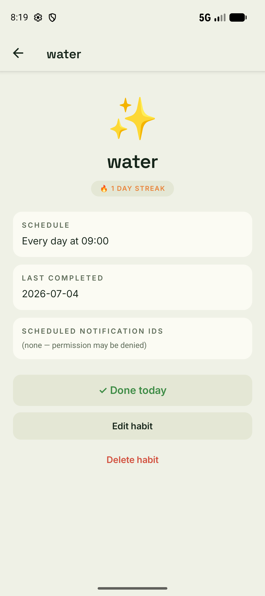
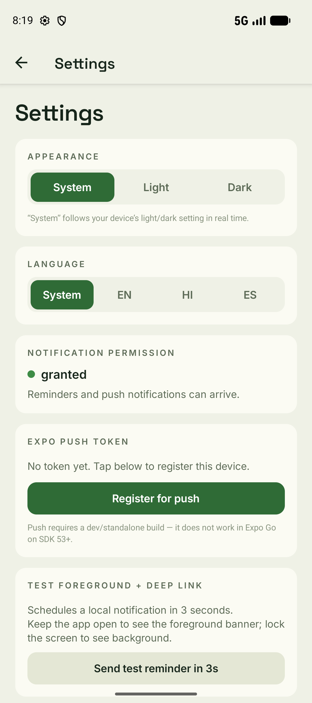

# Streaks — Habit Tracker with Notifications

A React Native + Expo SDK 55 habit tracker that schedules local reminders and
receives Expo push notifications, with shared deep-link handling.

> See [PLAN.md](PLAN.md) for the full architecture, rubric checklist, and
> milestone breakdown.

---

## Demo

<p align="center">
  
  
  
  
  
</p>

| Screen | What it shows |
|---|---|
| **Landing** ([onboarding.tsx](src/app/onboarding.tsx)) | Branded welcome hero with the mascot + **Get started** → opens the app |
| **Today** ([index.tsx](src/app/index.tsx)) | Time-of-day greeting, week strip, contextual tip, progress, habit rows with a quick-complete toggle |
| **New / edit habit** ([new.tsx](src/app/new.tsx)) | Name, daily/weekly frequency, 24h reminder time |
| **Habit detail** ([habit/[id].tsx](src/app/habit/[id].tsx)) | Streak, schedule, last completed, notification IDs, done/edit/delete — the deep-link target |
| **Settings** ([settings.tsx](src/app/settings.tsx)) | Appearance, language, notification permission, Expo push token, test reminder |

**Demo video:** _add link before submission_

---

## Quick start

```bash
npm install
npx expo install --check        # align native module versions with SDK 55
npm start                       # Metro for the dev client
```

Push notifications **do not work in Expo Go on SDK 53+**. Build a development
client first:

```bash
npx eas-cli login
npx eas-cli init                # writes the projectId
npx eas-cli build --profile development --platform android
# (or --platform ios with credentials)
```

Then replace `extra.eas.projectId` in [app.json](app.json) with the printed id
and install the resulting APK / TestFlight build on a **real device**
(emulators / simulators can run the app but cannot receive push tokens).

### Test push from the dev client

1. Open the **Settings** tab → tap **Enable notifications** → **Register for push**.
2. Copy the `ExponentPushToken[…]` shown.
3. Send a push three different ways — they all go through the same in-app
   handler:

   **a. expo.dev/notifications** — paste token, set `data` to
   `{ "screen": "/habit", "habitId": "<an existing id>" }`.

   **b. cURL**

   ```bash
   curl -X POST https://exp.host/--/api/v2/push/send \
     -H 'Content-Type: application/json' \
     -d '[{
       "to":"ExponentPushToken[xxxxxxxx]",
       "title":"🔥 Streak nudge",
       "body":"Tap to log it",
       "channelId":"habit-reminders",
       "data":{"screen":"/habit","habitId":"<id>"}
     }]'
   ```

   **c. Node helper** (under [server/](server/))

   ```bash
   cd server && npm install
   TOKEN='ExponentPushToken[…]' HABIT_ID='<id>' npm run send
   # ~10 min later
   npm run receipts
   ```

---

## Over-the-air (OTA) updates

JS + asset changes ship without a store review via **EAS Update**. The project
is linked to EAS (`extra.eas.projectId` in [app.json](app.json)) with
`runtimeVersion.policy = "appVersion"`, so an update only reaches builds whose
native runtime matches.

```bash
eas update --branch preview    -m "your message"   # → preview builds
eas update --branch production -m "your message"   # → production builds
```

Bump the native `version` in [app.json](app.json) whenever you change native
code, so older binaries never pull incompatible JS. Dev clients don't consume
updates — build a `preview`/`production` profile to test OTA end to end.

---

## Ship to Google Play

`eas.json` has a `submit.production.android` profile (internal track, draft).

```bash
eas build  -p android --profile production      # signed .aab (EAS-managed keystore)
eas submit -p android --profile production      # upload to the Play internal track
```

Prerequisites you provide once: a Google Play developer account, the app entry
(`com.streaks.app`), the first manual `.aab` upload, and a service-account JSON
saved as `google-service-account.json` in the repo root (gitignored).

---

## Scripts

| script | purpose |
|---|---|
| `npm start` | Metro dev server (dev-client mode) |
| `npm run start:go` | Metro for Expo Go (no push) |
| `npm run android` / `ios` | Native run |
| `npm run typecheck` | `tsc --noEmit` |
| `npm run prebuild` | Generate native projects |

---

## Documentation

| Doc | Purpose |
|---|---|
| [docs/VERIFICATION.md](docs/VERIFICATION.md) | Per-rubric-item manual test checklist (foreground handler, Android channel, push token, deep link, stretch goals). |
| [docs/DEMO.md](docs/DEMO.md) | Storyboard for the demo video + required screenshot list. |
| [PLAN.md](PLAN.md) | Original implementation plan and architecture notes. |
| [server/README.md](server/README.md) | Node push helper usage. |

---

## Architecture

```
src/
  app/                         # expo-router screens
    _layout.tsx                # installs handler, channel, tap-router
    onboarding.tsx             # welcome / landing hero → Get started
    index.tsx                  # today list, week strip, done, streak chips
    new.tsx                    # create + edit form (?id=<x> = edit)
    habit/[id].tsx             # deep-link target
    settings.tsx               # permission, push token, test reminder
  lib/
    habits/
      types.ts                 # Habit, Frequency, NotificationDeepLink
      storage.ts               # AsyncStorage CRUD, versioned envelope
      streak.ts                # pure markDone / getDisplayStreak / isDoneToday
      id.ts                    # tiny uuid v4-ish
    notifications/
      setup.ts                 # foreground handler, Android channel, perms
      schedule.ts              # scheduleHabit / cancelHabit / rescheduleHabit
      push.ts                  # registerForPushNotificationsAsync, token store
      router.ts                # pure resolveHref(data) → href
  hooks/
    use-habits.ts              # reactive store + schedule-aware CRUD
    use-push-notifications.ts  # token + permission state
    use-notification-router.ts # tap → expo-router navigate
server/                        # optional Node sender + receipts
```

### Data flow

```
Screen → Hook → lib/habits/storage          (persistence)
              → lib/notifications/schedule  (OS reminders)
              → lib/notifications/push      (Expo push registration)

Notification tap (local or push)
  → expo-notifications response listener
  → lib/notifications/router.resolveHref()
  → use-notification-router → router.push('/habit/[id]')
```

**Rules baked into the codebase:**
- No `Notifications.*` calls inside components — only inside `lib/notifications/*`.
- `cancelHabit` only cancels IDs stored on that habit. There is no
  `cancelAllScheduledNotificationsAsync` anywhere in product code.
- Local and push notifications share the same payload shape
  (`{ screen: '/habit', habitId }`) so the tap router treats them identically.
- The foreground handler is installed at **module load** in
  [`_layout.tsx`](src/app/_layout.tsx), before React mounts — never inside a
  component effect.

---

## Conceptual writeup (rubric §9)

### 1. Local vs push notifications

| | Local | Push |
|---|---|---|
| Origin | Scheduled by the device against a local OS queue | Originates from a server, routed APNs / FCM → Expo → device |
| Works offline? | Yes — the OS holds the trigger | No — needs a network round-trip |
| Needs a token? | No | Yes (`ExponentPushToken[…]` per install) |
| Best for | Known future reminders (a habit time, a calendar event) | Server-driven events (announcements, streak nudges based on server-side state, image campaigns) |
| Survives reboot? | Yes — OS persists the schedule | N/A |

In this app, **habit reminders are local** (we know the schedule the moment
the user saves the habit) and **streak nudges / announcements would be push**
(server decides who, when, what).

### 2. Push ticket vs push receipt

- A **ticket** is the response from `POST https://exp.host/--/api/v2/push/send`.
  It only tells you that **Expo's push service accepted** the message
  (`{ status: 'ok', id }`).
- A **receipt** is fetched later from
  `POST https://exp.host/--/api/v2/push/getReceipts` using those ticket ids.
  It tells you whether **APNs / FCM accepted** the message (and surfaces
  errors that the ticket cannot see: `DeviceNotRegistered`, `MessageTooBig`,
  `MessageRateExceeded`, `InvalidCredentials`).
- Expo recommends polling receipts **~15 minutes after sending**.
- See [server/receipts.js](server/receipts.js) for a working example.

### 3. `DeviceNotRegistered`

A receipt with `details.error === 'DeviceNotRegistered'` means **the token is
permanently dead** on that device. Possible causes:

- the app was uninstalled,
- the user revoked notification permission,
- the app was reinstalled (which rotates the token), or
- the device was wiped.

**Server obligation:** the moment you see this error, **delete the token from
your database** so it is never pushed to again. Continuing to send produces
no notifications and counts against your rate limits.

### 4. Expo Go limitation

Starting with **SDK 53**, Expo Go does **not** ship the entitlements required
to register for or receive remote pushes. Trying to call
`getExpoPushTokenAsync()` inside Expo Go either returns `null` or throws. To
test push you must build a **development client** (`eas build --profile
development`) or a standalone build. **Local notifications still work in
Expo Go** — only push is blocked.

### 5. Why the Android channel must exist *before* requesting permission

On Android 8+, every notification belongs to a channel that defines its
importance, sound, vibration, and lock-screen visibility. The user can later
change those values; the app cannot override them. Two consequences shape
the boot order:

1. **Android 13+ permission dialog** inspects existing channels when it
   surfaces. If the channel is missing, the dialog shows generic copy and the
   user has no way to tune importance per channel afterwards.
2. **Notifications posted before the channel exists** fall through to the
   default low-importance bucket and never show as heads-up banners — even
   after the channel is created.

Therefore we call `Notifications.setNotificationChannelAsync('habit-reminders',
{ importance: HIGH, … })` on **every cold start** in
[`_layout.tsx`](src/app/_layout.tsx), and **before** any code path can call
`requestPermissionsAsync`. The call is idempotent — repeating it just
re-applies the same config.

### 6. Foreground vs background push behavior

- **Foreground (app is open and focused):** by default the OS suppresses the
  banner because "the user is already in the app." We override that with
  `Notifications.setNotificationHandler({ handleNotification: async () => ({
  shouldShowBanner: true, shouldShowList: true, shouldPlaySound: true,
  shouldSetBadge: true }) })` installed at module load. This makes reminders
  visible even while the user is browsing the home screen.
- **Background / killed:** the OS shows the system notification regardless of
  the in-app handler. Tapping it produces a `NotificationResponse` that we
  handle in two places:
  - if the app is launched cold, we read it once via
    `getLastNotificationResponseAsync()`,
  - if the app was merely backgrounded, the
    `addNotificationResponseReceivedListener` fires when the user taps.

Both paths funnel through `resolveHref(data)` → `router.push('/habit/[id]')`,
so the user always lands on the right screen.

---

## Permission flow

```
boot → installForegroundHandler() (module load)
     → ensureAndroidChannel()      (root layout mount)
     → user opens Settings
     → "Enable notifications" → requestPermissionsAsync
           ├── granted    → "Register for push" → getExpoPushTokenAsync
           ├── denied + canAskAgain → user is re-prompted on next try
           └── denied + !canAskAgain → "Open system settings" CTA
```

The scheduling layer is permission-aware: `scheduleHabit` checks
`getPermissions().granted` and returns `[]` if not granted, so habit creation
never crashes — the user simply has no reminders until they re-enable.

---

## Deep linking — same handler, both kinds

```ts
// src/lib/notifications/router.ts
export function resolveHref(data: unknown): ResolvedHref {
  if (isDeepLinkPayload(data)) {
    return { kind: 'habit', habitId: data.habitId, href: `/habit/${data.habitId}` };
  }
  return { kind: 'fallback', href: '/' };
}
```

```ts
// src/hooks/use-notification-router.ts (excerpt)
Notifications.addNotificationResponseReceivedListener((response) => {
  const resolved = resolveHref(response.notification.request.content.data);
  if (resolved.kind === 'habit') router.push(resolved.href);
});
```

**Same listener fires for local reminders and Expo push.** Stale payloads
(habit deleted) render a "Habit not found" screen in
[habit/[id].tsx](src/app/habit/[id].tsx) rather than crashing.

---

## Rubric self-check

| § | Item | Status |
|---|---|---|
| 1 | Habit CRUD + persistence + notificationIds stored | ✅ |
| 2 | Daily + weekly schedule, edit replaces IDs, delete cancels only own | ✅ |
| 3 | Streak +1 / reset / idempotent / visible | ✅ |
| 4 | Local + push tap → same handler → habit detail | ✅ |
| 5 | Permission flow, denied state, open settings, foreground handler | ✅ |
| 6 | High-importance Android channel before permission | ✅ |
| 7 | Push register, token display, copy, deep-link payload | ✅ (needs dev build to verify on device — see [VERIFICATION.md](docs/VERIFICATION.md)) |
| 8 | No notifications in components, hooks clean, errors handled | ✅ |
| 9 | Writeup answers | ✅ (above) |
| 10 | Demo + submission | see [DEMO.md](docs/DEMO.md) storyboard |
| Stretch | Snooze action button | ✅ |
| Stretch | Done action button | ✅ |
| Stretch | App badge count | ✅ |
| Stretch | Quiet hours window | ✅ |

---

## Known limits / next steps

- Time picker uses simple numeric inputs (no `DateTimePicker`) to avoid an
  extra native dep — easy upgrade later.
- Image push and calendar heatmap stretch goals not yet implemented.
- The dev build itself must be produced with **your** EAS account; the
  scripts and config are in place but the artifact is not in this repo.

